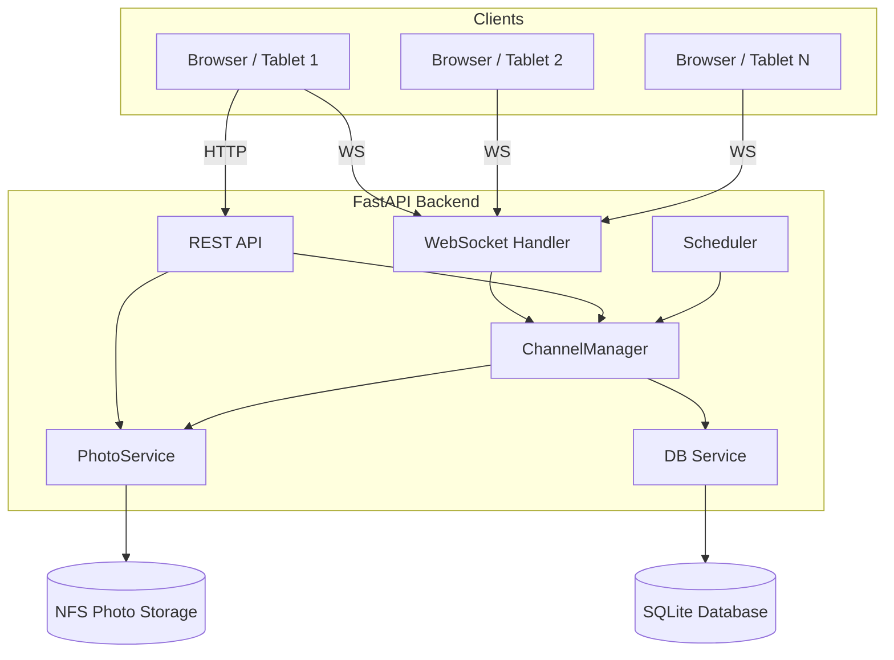
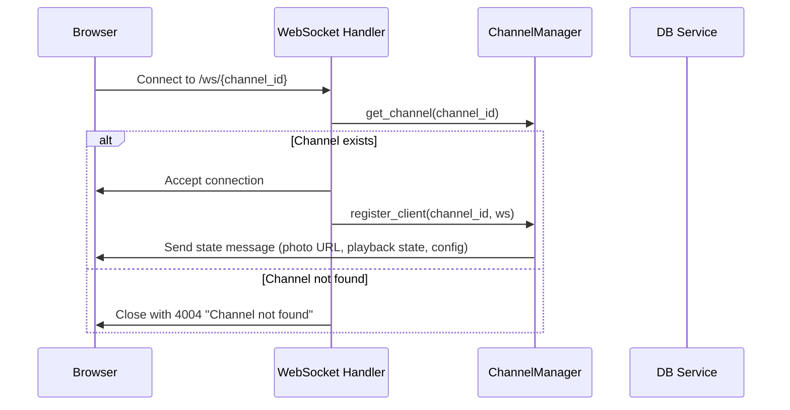
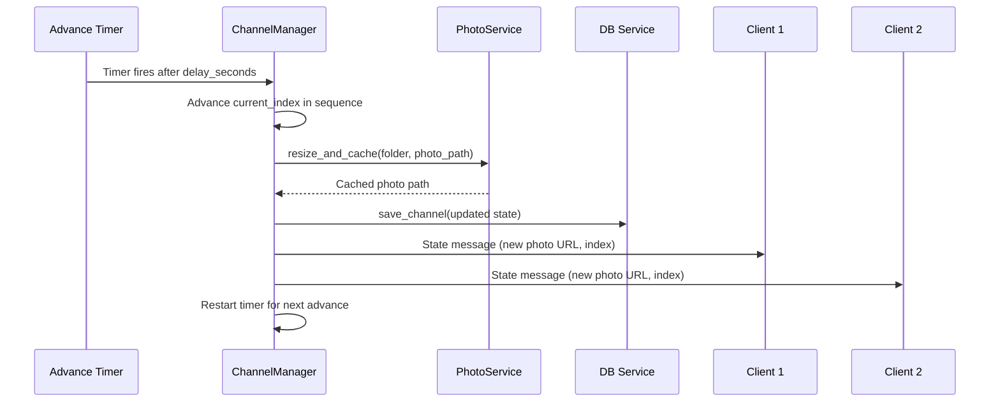
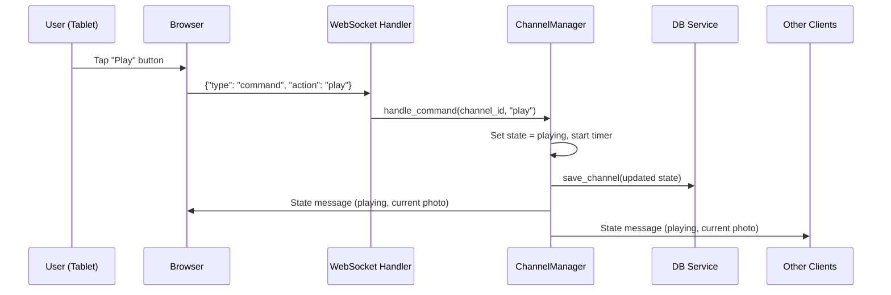
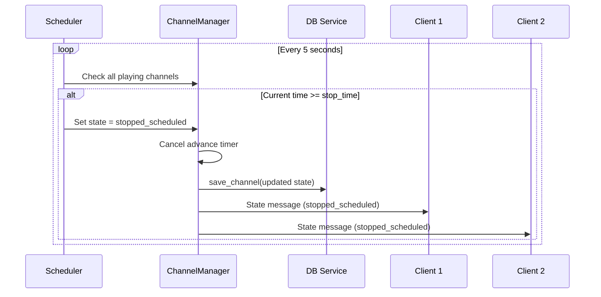
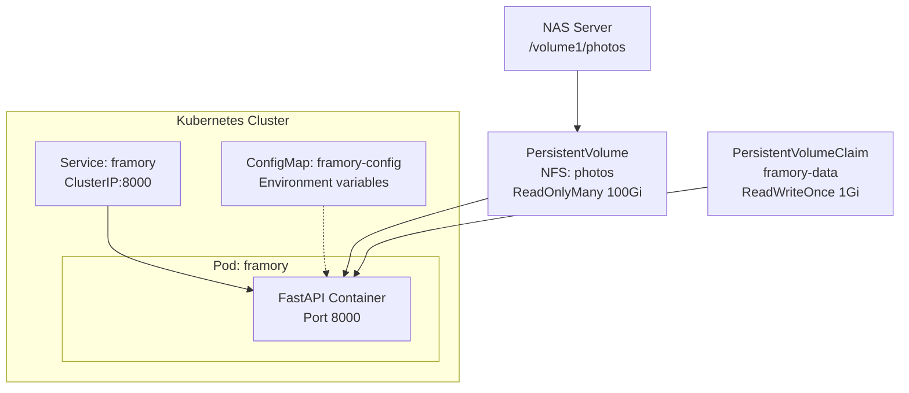

# Architecture

This document describes Framory's system design, component interactions, data
model, and deployment topology.

## High-Level Architecture



### Components

- **Browser Clients** — React single-page application running on tablets,
  phones, or any device with a browser. Connects to a channel via WebSocket for
  real-time state updates and sends commands (play, stop, next, prev) back to
  the server. Key UI components include:
  - `CreateChannelForm` — channel creation with name validation and folder
    selection, accessible from the home screen
  - `FolderBrowser` — reusable folder navigation with photo counts, used in
    both channel creation and settings
  - `PlaybackControls` — playback buttons including a Home button for
    navigating back to the channel list
  - `ProgressBar` — thin line animation over `delay_seconds`, toggled per
    channel via `SettingsPanel`

- **REST API** (`app/api/routes.py`) — HTTP endpoints for channel management
  (`GET /api/channels`, `GET /api/channels/{id}`, `POST /api/channels` with
  optional `folder` parameter for immediate photo scanning), health checks
  (`GET /api/health`), photo serving (`GET /api/channels/{id}/photo`), and
  folder browsing (`GET /api/folders`).

- **WebSocket Handler** (`app/api/websocket.py`) — Manages persistent
  connections per channel. Accepts `command`, `configure`, and `ping` messages
  from clients. On connect, sends the current channel state so new clients
  immediately sync.

- **ChannelManager** (`app/services/channel_manager.py`) — Core state machine.
  Holds all channel state in memory, manages the client registry (which
  WebSockets are connected to which channel), processes commands (play/stop/next/
  prev/reset), handles configuration changes, and broadcasts state updates to
  all connected clients. Persists state to SQLite after each mutation.

- **PhotoService** (`app/services/photo_service.py`) — Scans photo folders on
  the NFS mount for JPEG files, generates shuffled playback sequences
  (Fisher-Yates), extracts EXIF metadata (date taken), and resizes photos to a
  configurable maximum dimension (default 1920 px) with disk caching.

- **Scheduler** (`app/services/scheduler.py`) — Background task that checks
  every 5 seconds whether any playing channel has reached its configured daily
  stop time. If so, it transitions the channel to `stopped_scheduled` state and
  broadcasts the update.

- **DB Service** (`app/services/db.py`) — Thin async wrapper around aiosqlite.
  Initializes the database schema, and provides CRUD operations for channel
  persistence. Uses WAL journal mode for concurrent reads.

- **SQLite Database** — Single-file database storing channel configuration and
  playback state. An `updated_at` trigger auto-updates timestamps on writes.

- **NFS Photo Storage** — Network-attached storage mounted read-only into the
  container. Contains photo folders organized by the user (e.g., `family/`,
  `vacation/`).

## Sequence Diagrams

### Client Connection & Initial Sync

When a client opens a channel page, it establishes a WebSocket connection. The
server accepts the connection, registers the client, and immediately sends the
current channel state so the client displays the correct photo.



### Photo Advance Flow

When a channel is playing, the ChannelManager runs a timer for the configured
delay. When the timer fires, the next photo in the shuffled sequence is selected
and broadcast to all connected clients.



### Playback Command Flow

When a user taps a control (e.g., play or stop), the client sends a command
message over WebSocket. The ChannelManager processes the command, updates state,
persists to the database, and broadcasts the new state to all connected clients.



### Scheduled Stop Flow

The Scheduler runs a background loop checking every 5 seconds whether any
playing channel has reached its configured stop time.



## Data Model

### Channel Entity

The `Channel` model (`app/models/channel.py`) is the central domain object:

| Field | Type | Default | Description |
| ----- | ---- | ------- | ----------- |
| `id` | string | *(required)* | Unique identifier (2–50 chars, lowercase alphanumeric + hyphens) |
| `folder` | string | `""` | Photo folder path relative to the photo root |
| `delay_seconds` | integer | `60` | Seconds between photo advances (minimum 5) |
| `stop_time` | string | `"00:00"` | Daily auto-stop time in HH:MM format |
| `state` | PlaybackState | `stopped_manual` | Current playback state |
| `current_index` | integer | `0` | Position in the shuffled sequence |
| `history` | list[int] | `[]` | Stack of previous indices (for "previous" navigation) |
| `sequence` | list[string] | `[]` | Shuffled list of photo filenames |
| `show_progress_bar` | boolean | `true` | Whether to display the progress bar animation |
| `created_at` | datetime | *(auto)* | Channel creation timestamp |
| `updated_at` | datetime | *(auto)* | Last modification timestamp |

### Playback States

```text
playing              → Slideshow is running, timer advances photos
stopped_manual       → User explicitly stopped playback
stopped_scheduled    → Scheduler stopped playback at the configured stop_time
stopped_no_clients   → All clients disconnected, playback paused automatically
```

### Photo Metadata

The `Photo` model holds metadata extracted from JPEG files:

- `filename` — File name on disk
- `date_taken` — From EXIF tag 36867 (DateTimeOriginal) or 306 (DateTime)
- `date_modified` — File system modification time
- `file_size` — Size in bytes

### Database Schema

SQLite stores channels in a single `channels` table with an `updated_at`
trigger that auto-updates the timestamp on every write. The `history` and
`sequence` fields are stored as JSON strings. WAL journal mode is enabled for
concurrent read access.

## Architectural Decisions

| Decision | Choice | Rationale |
| -------- | ------ | --------- |
| Database | SQLite (aiosqlite) | Single-instance deployment; no external database server needed; file-based storage simplifies backups and Docker volumes |
| Real-time protocol | WebSocket | Bidirectional communication needed — clients send commands and receive state updates; SSE would only support server-to-client |
| Photo format | JPEG only | Covers the vast majority of camera photos; simplifies EXIF extraction and Pillow processing; PNG/HEIC support can be added later |
| State management | In-memory with DB persistence | Fast reads for real-time broadcasting; SQLite persistence ensures state survives restarts |
| Instance model | Single instance | Home deployment on a single device (Raspberry Pi, NAS); no need for distributed state or horizontal scaling |
| Photo serving | Resize + disk cache (Pillow) | Original photos from NAS can be very large; resizing to max 1920 px reduces bandwidth; disk cache avoids re-processing |
| Frontend framework | React 19 + Vite | Modern component model with hooks; Vite provides fast HMR and optimized builds; Tailwind for utility-first styling |
| Container strategy | Multi-stage Docker build | Minimizes image size — frontend built with Node.js, only static assets copied to Python runtime image |

## Deployment Architecture



### Deployment Components

- **Deployment** — Single replica running the `framory:latest` image. Mounts
  photos read-only at `/photos` and data read-write at `/data`. Includes
  liveness and readiness probes on `/api/health`.

- **Service** — ClusterIP service exposing port 8000 within the cluster. An
  Ingress or reverse proxy (not included) would expose the service externally.

- **ConfigMap** — All `FRAMORY_*` environment variables injected into the
  container. Edit this to change photo root, timezone, default delay, etc.

- **NFS PersistentVolume** — Connects to the NAS server for photo storage.
  Mounted as `ReadOnlyMany` so the application never modifies original photos.

- **Data PVC** — `ReadWriteOnce` claim (1 Gi) for the SQLite database and photo
  cache. Backed by the cluster's default storage class.

- **Resource limits** — CPU: 100m request / 500m limit. Memory: 128Mi request /
  512Mi limit.
